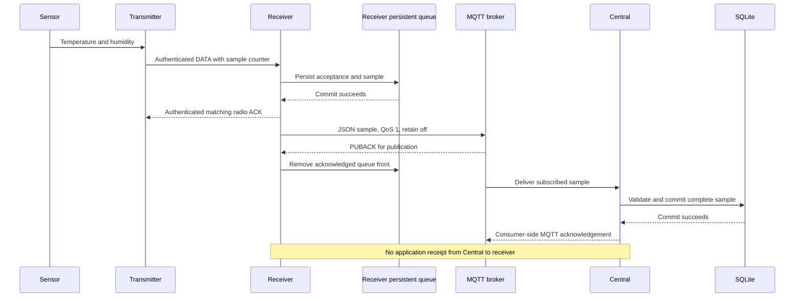

# A measurement's journey

[Documentation home](../README.md) · [MQTT](mqtt-integrations.md)

Example: a climate sensor returns temperature and humidity. These are two metrics
of one sensor, grouped in one sample. The following describes successful delivery;
the failure cases below matter just as much.

Broker delivery to consumers and its PUBACK to the publisher may occur in a different
order. The sequence separates responsibilities; it is not a global timing guarantee.

## Three boundaries, not one end-to-end receipt

| Confirmation | What it establishes | What it does not establish |
| --- | --- | --- |
| Radio ACK | Receiver durably accepted this frame | Broker or Central received it |
| Publisher PUBACK | Broker completed the MQTT acknowledgement step | Central stored it, broker fsync, or even ACL acceptance under MQTT 3.1.1 |
| Central's consumer ACK | Central stored or permanently rejected its delivery | A new application-level receipt sent back to the receiver |

Under MQTT 3.1.1, a broker can acknowledge an ACL-denied publication. Validate
permissions by checking downstream receipt, not only a successful publish callback.

## Identity and time

The encrypted radio payload includes metric IDs, units, statuses and values. A sample
counter and enrollment generation form the forwarded `sample_id`. Central deduplicates
by `(source_id, device_id, sample_id)`; a retry keeps this identity. Different content
under the same identity is a conflict.

The radio format has no wall-clock measurement timestamp. The receiver omits
`measured_at`, and Central records arrival time. A queued old measurement can therefore
arrive now. Do not interpret a freshly received backlog as proof of a current measurement.
An error or skipped status is not a valid zero measurement.

## Where loss is still possible

- A transmitter exhausts its bounded attempts: it does not retain that sample for the next wake.
- Radio ACK is lost after receiver acceptance: a retry is recognized, without accepting a second copy.
- Broker is unavailable: receiver queues samples, but drops the oldest once its 128-sample capacity fills.
- PUBACK is lost: receiver republishes; consumers must tolerate duplicates.
- Central is offline: its broker session can buffer messages, subject to queue/expiry limits.
- Broker permissions, persistence failures or capacity limits can still cause data loss.

Sources: [durable radio acceptance](https://github.com/cajui/cajui-firmware/blob/a2ce332b2e3ff704f8e35032381786497c287968/docs/protocol-v1.md),
[forwarding](https://github.com/cajui/cajui-firmware/blob/a2ce332b2e3ff704f8e35032381786497c287968/docs/radio-applications.md),
[consumer delivery and silence rules](https://github.com/cajui/cajui-central/blob/76a9a189d9a8101bc74b07f6723f9541f9acb05d/README.md).
