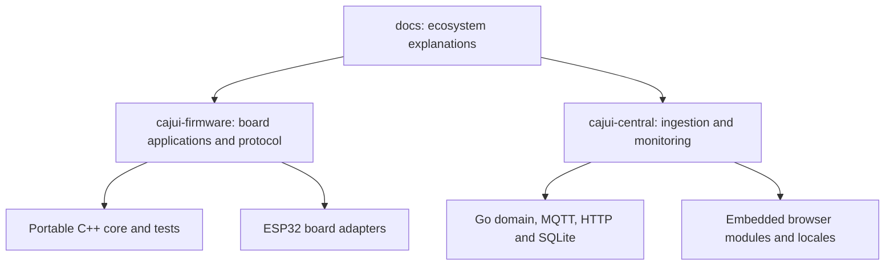

# Development map

[Documentation home](../README.md) · [Capability inventory](inventory.md)

## Repository responsibilities

The docs repository owns explanations spanning projects. Technical specifications and
implementation instructions remain with their code. Update the cross-project map when
behavior changes; do not create a second independent copy of every protocol field.

## Firmware code map

| Location | Purpose |
| --- | --- |
| `lib/CajuiProtocol` | Wire encoding, authenticated frames, sender/receiver decisions |
| `lib/CajuiRuntime` | Nonblocking send cycle, injected radio/clock/jitter interfaces |
| `lib/CajuiApplication` | Receiver application logic and measurement normalization |
| `lib/CajuiStorage` | Durable records, queue, counters, migrations and NVS adapter |
| `lib/CajuiProvisioning`, `tools/` | USB administration and enrollment tooling |
| `lib/CajuiPairing` | Radio pairing exchange and state machines |
| `lib/CajuiSensors` | SHT4x driver in PR #25 |
| `lib/CajuiUplink` | MQTT formatting, forwarding, management and Discovery |
| `lib/CajuiSetup` | Setup rendering, validation and recovery decisions |
| `lib/CajuiDevice` | Boot mode, power and fault-retry decisions |
| `lib/CajuiFirmware` | Signed-update verification |
| `src/board`, role entry points | Hardware and runtime integration |

Source: [firmware tree](https://github.com/cajui/cajui-firmware/tree/a2ce332b2e3ff704f8e35032381786497c287968) and [module boundaries](https://github.com/cajui/cajui-firmware/tree/a2ce332b2e3ff704f8e35032381786497c287968/docs/runtime.md).

## Central code map

Start from [the repository README](https://github.com/cajui/cajui-central/blob/76a9a189d9a8101bc74b07f6723f9541f9acb05d/README.md). `cmd/cajui` wires the server;
`internal/storage` owns SQLite, `internal/mqttingest` consumes broker traffic, and
`internal/httpapi` provides APIs and embedded UI assets. Locale sources live under
`locales`; browser tests live under `tests/ui`. Brand reference documentation is
separate from the running monitoring interface.

## What validation proves

Firmware uses Unity host tests, failure-injection storage doubles, Python tooling tests,
coverage gates, lint, fuzzing and ESP32 compilation. Compilation does not run the tests
on a board or establish RF reliability, current draw or ingress protection.

Central uses Go tests/race checks, broker integration tests and browser tests. Home
Assistant template checks are not a full HA installation test. Keep these distinctions
in release notes and feature status.

See [firmware testing](https://github.com/cajui/cajui-firmware/tree/a2ce332b2e3ff704f8e35032381786497c287968/docs/testing.md) and
[Central development checks](https://github.com/cajui/cajui-central/blob/76a9a189d9a8101bc74b07f6723f9541f9acb05d/README.md). Avoid timeless coverage percentages
in guides; test results belong to a particular revision and run.
