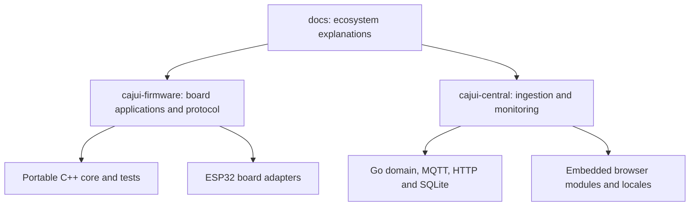

# Development

[Documentation](../README.md)

## Repositories and modules

Cross-project architecture and deployment guides live in this repository. Wire formats,
API contracts and build instructions are maintained alongside their implementations.

### Firmware

| Location | Responsibility |
| --- | --- |
| `lib/CajuiProtocol` | Wire encoding, authenticated frames and delivery decisions |
| `lib/CajuiRuntime` | Nonblocking send cycle and radio, clock and jitter interfaces |
| `lib/CajuiApplication` | Receiver application logic and measurement normalization |
| `lib/CajuiStorage` | Durable records, queue, counters, migrations and NVS adapter |
| `lib/CajuiProvisioning`, `tools/` | USB administration and enrollment |
| `lib/CajuiPairing` | Radio pairing frames and state machines |
| `lib/CajuiSensors` | SHT4x driver in the development firmware |
| `lib/CajuiUplink` | MQTT formatting, forwarding, management and Discovery |
| `lib/CajuiSetup` | Setup rendering, validation and recovery decisions |
| `lib/CajuiDevice` | Boot mode, power and fault-retry decisions |
| `lib/CajuiFirmware` | Signed-update verification |
| `src/board` and role entry points | ESP32 adapters and application integration |

The portable core separates protocol decisions from board-specific drivers. See the
[firmware module contract](https://github.com/cajui/cajui-firmware/blob/a2ce332b2e3ff704f8e35032381786497c287968/docs/runtime.md) for interfaces and lifetime requirements.

### Central

`cmd/cajui` wires the server. `internal/storage` owns SQLite persistence,
`internal/mqttingest` handles subscriptions and ingestion, and `internal/httpapi` serves
APIs and the embedded interface. Locale sources live under `locales`, and browser tests
under `tests/ui`. Brand and component references are maintained separately under `docs/brand`.

See [Central development instructions](https://github.com/cajui/cajui-central/blob/76a9a189d9a8101bc74b07f6723f9541f9acb05d/README.md) for build and test commands.

## Testing

Firmware validation includes Unity host tests, failure-injection storage doubles,
Python tooling tests, coverage gates, static analysis, fuzzing and ESP32 compilation.
Hardware testing covers separate concerns such as radio timing, interference, power
consumption and physical storage behavior.

Central validation includes Go tests, race detection, MQTT integration tests and browser
tests. Home Assistant template tests verify configuration output without running a full
Home Assistant instance.

Test results and coverage apply to the revision and environment in which they were
measured. See [firmware testing](https://github.com/cajui/cajui-firmware/blob/a2ce332b2e3ff704f8e35032381786497c287968/docs/testing.md) and [version coverage](status.md).

## Documentation contributions

Edit Markdown and Mermaid sources directly. Run `python3 scripts/check_docs.py` and
preview affected diagrams before submitting changes. See [CONTRIBUTING.md](../CONTRIBUTING.md).
