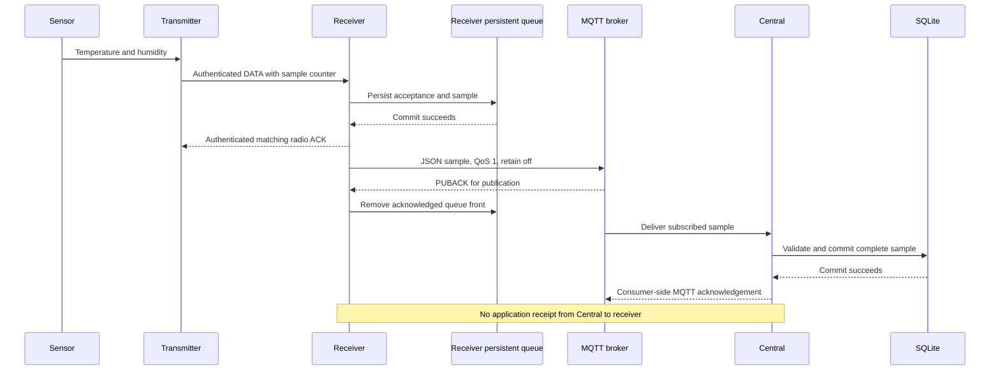

# Data flow and delivery semantics

English | [Português brasileiro](../pt-BR/data-flow.md)

[Documentation](../../README.md)

A transmitter groups sensor readings into a sample, assigns a counter and sends an
authenticated DATA frame. The receiver verifies the frame and persists its acceptance
before acknowledging it. Forwarding to MQTT runs independently of radio reception.

## Successful delivery

The broker may forward a message to subscribers before or after acknowledging the
publisher. Each acknowledgement belongs to its own connection and delivery stage.

## Acknowledgements

| Stage | Confirmation | Meaning |
| --- | --- | --- |
| Transmitter → receiver | Authenticated radio ACK | The receiver durably accepted the matching frame |
| Receiver → broker | MQTT PUBACK | The broker acknowledged the publication; the receiver may remove its queued copy |
| Broker → Central | Consumer-side MQTT acknowledgement | Central stored the sample or permanently rejected it |

There is no application-level receipt from Central to the receiver. A publisher PUBACK
does not guarantee consumer processing or broker disk synchronization. MQTT 3.1.1 also
allows acknowledgement of ACL-denied publications, so deployment checks must verify
successful downstream receipt.

## Sample identity

The radio payload contains sensor and metric identifiers, units, statuses and values.
The receiver combines the enrollment generation and sample counter into the forwarded
`sample_id`. Retries preserve this identity.

Central deduplicates samples by `(source_id, device_id, sample_id)`. Repeated content
under the same identity is accepted as a duplicate; changed content is rejected as a
conflict. A repeated sample does not extend the device's freshness deadline.

## Timestamps and measurement quality

The radio format carries no wall-clock measurement timestamp. The receiver omits
`measured_at`, and Central records `received_at` when it processes the sample. For queued
samples, that time reflects forwarding delay as well as acquisition time.

Each reading has a status. Error and skipped readings have no usable measurement value;
consumers must distinguish them from a valid zero reading.

## Buffering and failure handling

| Failure | Behavior |
| --- | --- |
| Radio attempts exhausted | The transmitter logs the failed cycle and resumes its schedule; the sample is not backlogged |
| Radio ACK lost | A retransmission is recognized through persisted acceptance state |
| Broker unavailable | The receiver retains queued samples and retries forwarding |
| Receiver queue full | The oldest sample is dropped to retain the newest 128 samples |
| Publisher PUBACK lost | The receiver republishes with the same sample identity |
| Central offline | Its persistent broker session buffers messages within configured queue and expiry limits |

Broker permissions, bounded queues and storage failures can still cause data loss.

## References

[Radio protocol](https://github.com/cajui/cajui-firmware/blob/a2ce332b2e3ff704f8e35032381786497c287968/docs/protocol-v1.md) ·
[MQTT forwarding](https://github.com/cajui/cajui-firmware/blob/a2ce332b2e3ff704f8e35032381786497c287968/docs/radio-applications.md) ·
[Central ingestion](https://github.com/cajui/cajui-central/blob/76a9a189d9a8101bc74b07f6723f9541f9acb05d/README.md)
