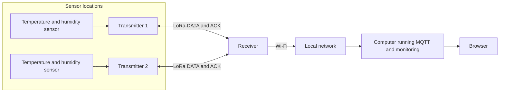
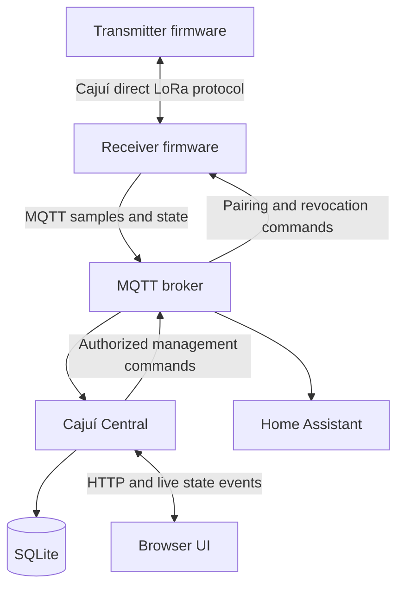

# System overview

[Documentation home](../README.md) · [Capability inventory](inventory.md)

Cajuí transports measurements from sensor nodes to software on a local network.
A transmitter reads its connected sensor and sends a LoRa frame. A receiver accepts
that frame and forwards a sample to an MQTT broker. Cajuí Central or Home Assistant
can consume the sample; neither consumer is part of the LoRa radio link.

## Physical arrangement

This is a topology illustration, not a claim about a particular installation,
range or number of tested nodes. Remote transmitters do not need Wi-Fi coverage
in normal operation. The receiver needs connectivity to the broker. Local use does
not require a cloud service; internet may be needed to obtain software and updates.

## Software arrangement

The broker and Central may run on the same computer, including as separate containers.
The browser is a client of Central, not another server. Home Assistant is an alternative
or additional MQTT consumer; stopping Central does not prevent a receiver from publishing.

## Names that matter

- **Cajuí** refers to the ecosystem; **Cajuí Central** is the monitoring application.
- **Receiver** refers to the LoRa device, not the computer hosting Central.
- A **sensor** is a measuring component; a **measurement** is one quantity it reports.
  One SHT40 supplies temperature and humidity.
- A **transmitter** runs firmware and can carry sensor readings; its radio is not the sensor.
- **Firmware** is software installed on a board, not a separate physical box.

The protocol can describe several metrics, but current reference applications use one
climate sensor. This does not provide universal plug-and-play support for arbitrary sensors.

Sources: [firmware scope](https://github.com/cajui/cajui-firmware/blob/a2ce332b2e3ff704f8e35032381786497c287968/README.md), [Central scope](https://github.com/cajui/cajui-central/blob/76a9a189d9a8101bc74b07f6723f9541f9acb05d/README.md),
[Home Assistant integration](https://github.com/cajui/cajui-firmware/blob/a2ce332b2e3ff704f8e35032381786497c287968/docs/home-assistant.md).
