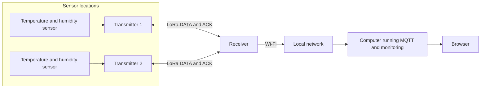
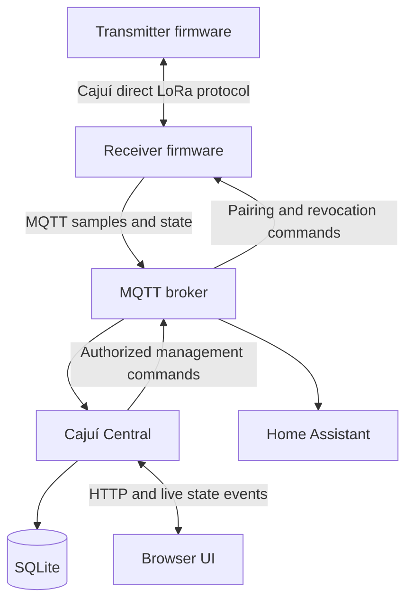

# Architecture

[Documentation](../README.md)

Cajuí uses a star topology to collect measurements from remote sensor nodes. Each
transmitter reads a connected sensor and sends authenticated LoRa frames to an enrolled
receiver. The receiver stores accepted samples and forwards them over Wi-Fi to an MQTT
broker. Applications subscribe to the broker to process and display the data.

## Physical topology

Transmitters operate within LoRa coverage of the receiver. Only the receiver requires
Wi-Fi access to the local network. The broker and monitoring application can run on the
same computer or separate hosts. Local telemetry and monitoring operate without a cloud
service; software downloads and updates may require internet access.

## Services and communication

The receiver firmware handles the radio link and MQTT forwarding. The broker routes
messages according to topic subscriptions and access rules. Cajuí Central validates
samples, stores them in SQLite and serves the browser interface. Home Assistant can
subscribe alongside Central or serve as the sole monitoring application.

An authorized application can also send management commands through MQTT to request
pairing or transmitter revocation. The receiver advertises the commands it supports.
Telemetry and management use separate topic families.

## Data model

- A **device** has a stable identity. Radio devices operate as transmitters or receivers.
- A **sensor** belongs to a transmitter and supplies one or more metrics.
- A **metric** identifies a quantity, such as temperature or relative humidity.
- A **sample** groups readings under a shared identity for delivery and deduplication.

For example, an SHT40 supplies temperature and humidity as two metrics from one sensor.
Current reference applications read one climate sensor per transmitter. The radio
format supports up to eight metrics per frame; additional sensor models require driver
and application support.

## Implementation references

[Firmware architecture](https://github.com/cajui/cajui-firmware/blob/a2ce332b2e3ff704f8e35032381786497c287968/docs/runtime.md) ·
[Central](https://github.com/cajui/cajui-central/blob/76a9a189d9a8101bc74b07f6723f9541f9acb05d/README.md) · [MQTT](mqtt-integrations.md) · [Data flow](data-flow.md)
