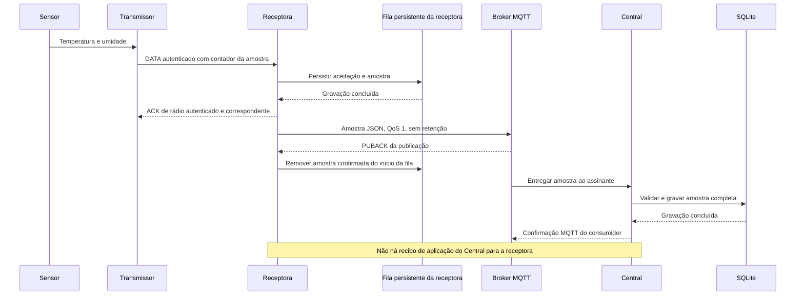

# Fluxo de dados e garantias de entrega

[English](../en/data-flow.md) | Português brasileiro

[Documentação](../../README.pt-BR.md)

Um transmissor agrupa leituras em uma amostra, atribui um contador e envia um quadro
DATA autenticado. A receptora verifica o quadro e persiste sua aceitação antes de
confirmá-lo. O encaminhamento MQTT funciona de forma independente da recepção de rádio.

## Entrega bem-sucedida

O broker pode encaminhar uma mensagem aos assinantes antes ou depois de confirmar
a publicação. Cada confirmação pertence à sua própria conexão e etapa de entrega.

## Confirmações

| Etapa | Confirmação | Significado |
| --- | --- | --- |
| Transmissor → receptora | ACK de rádio autenticado | A receptora aceitou de forma durável o quadro correspondente |
| Receptora → broker | PUBACK MQTT | O broker confirmou a publicação; a receptora pode remover sua cópia da fila |
| Broker → Central | Confirmação MQTT do consumidor | O Central armazenou a amostra ou a rejeitou de forma definitiva |

Não há recibo de aplicação do Central para a receptora. Um PUBACK ao publicador não
garante processamento pelo consumidor nem sincronização do broker com o disco. O
MQTT 3.1.1 também permite confirmar publicações negadas pela ACL, por isso a verificação
da implantação deve incluir o recebimento efetivo na aplicação de destino.

## Identidade da amostra

O conteúdo do quadro de rádio contém identificadores de sensores e métricas, unidades,
estados e valores. A receptora combina a geração do vínculo e o contador da amostra
no `sample_id` encaminhado. Novas tentativas preservam essa identidade.

O Central deduplica amostras por `(source_id, device_id, sample_id)`. Conteúdo repetido
sob a mesma identidade é reconhecido como duplicata; conteúdo diferente é rejeitado
como conflito. Uma amostra repetida não estende o prazo para considerar um dispositivo
sem dados recentes.

## Horários e qualidade da medição

O formato de rádio não inclui a data e a hora da medição. A receptora omite
`measured_at`, e o Central registra `received_at` ao processar a amostra. Para amostras
que ficaram na fila, esse horário incorpora o atraso de encaminhamento em relação à
coleta.

Cada leitura possui um estado. Leituras com erro ou puladas não têm um valor utilizável;
os consumidores devem distingui-las de uma medição válida de valor zero.

## Filas e tratamento de falhas

| Falha | Comportamento |
| --- | --- |
| Tentativas de rádio esgotadas | O transmissor registra a falha e retoma sua programação; a amostra não fica guardada para outro ciclo |
| ACK de rádio perdido | Uma retransmissão é reconhecida pelo estado de aceitação persistido |
| Broker indisponível | A receptora mantém amostras na fila e tenta encaminhá-las novamente |
| Fila da receptora cheia | A amostra mais antiga é descartada para manter as 128 mais recentes |
| PUBACK ao publicador perdido | A receptora republica com a mesma identidade de amostra |
| Central desconectado | Sua sessão persistente no broker armazena mensagens dentro dos limites de fila e expiração configurados |

Permissões do broker, limites de fila e falhas de armazenamento ainda podem causar
perda de dados.

## Referências

[Protocolo de rádio](https://github.com/cajui/cajui-firmware/blob/a2ce332b2e3ff704f8e35032381786497c287968/docs/protocol-v1.md) ·
[Encaminhamento MQTT](https://github.com/cajui/cajui-firmware/blob/a2ce332b2e3ff704f8e35032381786497c287968/docs/radio-applications.md) ·
[Ingestão no Central](https://github.com/cajui/cajui-central/blob/76a9a189d9a8101bc74b07f6723f9541f9acb05d/README.md)
