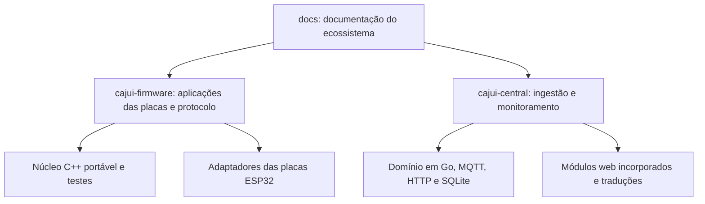

# Desenvolvimento

[English](../en/development.md) | Português brasileiro

[Documentação](../../README.pt-BR.md)

## Repositórios e módulos

A arquitetura entre projetos e os guias de implantação ficam neste repositório. Formatos
de mensagens, contratos de API e instruções de compilação são mantidos junto das
respectivas implementações.

### Firmware

| Localização | Responsabilidade |
| --- | --- |
| `lib/CajuiProtocol` | Codificação de mensagens, quadros autenticados e decisões de entrega |
| `lib/CajuiRuntime` | Ciclo de envio não bloqueante e interfaces de rádio, relógio e atraso aleatório |
| `lib/CajuiApplication` | Lógica da aplicação receptora e normalização de medições |
| `lib/CajuiStorage` | Registros duráveis, fila, contadores, migrações e adaptador NVS |
| `lib/CajuiProvisioning`, `tools/` | Administração e provisionamento por USB |
| `lib/CajuiPairing` | Quadros e máquinas de estado do pareamento por rádio |
| `lib/CajuiSensors` | Driver SHT4x no firmware de desenvolvimento |
| `lib/CajuiUplink` | Formatação MQTT, encaminhamento, gestão e Discovery |
| `lib/CajuiSetup` | Renderização da configuração, validação e decisões de recuperação |
| `lib/CajuiDevice` | Modo de inicialização, energia e decisões de nova tentativa após falhas |
| `lib/CajuiFirmware` | Verificação de atualizações assinadas |
| `src/board` e pontos de entrada de cada função | Adaptadores ESP32 e integração da aplicação |

O núcleo portável separa as decisões do protocolo dos drivers específicos da placa.
Consulte o [contrato dos módulos do firmware](https://github.com/cajui/cajui-firmware/blob/a2ce332b2e3ff704f8e35032381786497c287968/docs/runtime.md) para conhecer
as interfaces e os requisitos de tempo de vida dos objetos.

### Central

`cmd/cajui` conecta os componentes do servidor. `internal/storage` cuida da persistência
SQLite, `internal/mqttingest` trata as assinaturas e a ingestão, e `internal/httpapi`
serve APIs e a interface incorporada. Os catálogos de idioma ficam em `locales`,
e os testes de navegador em `tests/ui`. As referências de marca e componentes são
mantidas separadamente em `docs/brand`.

Consulte as [instruções de desenvolvimento do Central](https://github.com/cajui/cajui-central/blob/76a9a189d9a8101bc74b07f6723f9541f9acb05d/README.md) para
os comandos de compilação e teste.

## Testes

A validação do firmware inclui testes Unity no computador, implementações de teste de
armazenamento com injeção de falhas, testes das ferramentas Python, limites mínimos de
cobertura, análise estática, fuzzing e compilação para ESP32. Os testes de hardware
cobrem aspectos separados, como temporização de rádio, interferência, consumo de energia
e comportamento do armazenamento físico.

A validação do Central inclui testes Go, detecção de condições de corrida, testes de
integração MQTT e testes de navegador. Os testes de templates do Home Assistant
verificam a configuração gerada sem executar uma instância completa do Home Assistant.

Resultados e cobertura dos testes se aplicam à revisão e ao ambiente em que foram
medidos. Consulte [testes do firmware](https://github.com/cajui/cajui-firmware/blob/a2ce332b2e3ff704f8e35032381786497c287968/docs/testing.md) e [versões documentadas](status.md).

## Contribuições à documentação

Edite os arquivos Markdown e os diagramas Mermaid diretamente. Execute
`python3 scripts/check_docs.py` e confira os diagramas afetados antes de enviar alterações.
Consulte [CONTRIBUTING.pt-BR.md](../../CONTRIBUTING.pt-BR.md).
