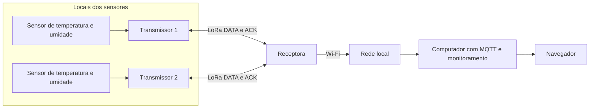
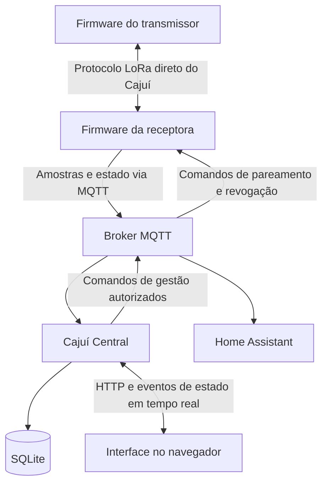

# Arquitetura

[English](../en/overview.md) | Português brasileiro

[Documentação](../../README.pt-BR.md)

O Cajuí usa uma topologia em estrela para coletar medições de sensores remotos. Cada
transmissor lê um sensor conectado e envia quadros LoRa autenticados à receptora com
a qual está vinculado. A receptora armazena as amostras aceitas e as encaminha por
Wi-Fi a um broker MQTT. As aplicações assinam tópicos no broker para processar e
exibir os dados.

## Topologia física

Os transmissores operam dentro da cobertura LoRa da receptora. Apenas a receptora
precisa de acesso Wi-Fi à rede local. O broker e a aplicação de monitoramento podem
rodar no mesmo computador ou em máquinas separadas. A telemetria e o monitoramento
local funcionam sem um serviço de nuvem; downloads e atualizações de software podem
exigir acesso à internet.

## Serviços e comunicação

O firmware da receptora cuida do enlace de rádio e do encaminhamento MQTT. O broker
distribui mensagens conforme as assinaturas de tópicos e as regras de acesso. O Cajuí
Central valida amostras, armazena os dados no SQLite e fornece a interface do navegador.
O Home Assistant pode assinar os tópicos junto com o Central ou ser a única aplicação
de monitoramento.

Uma aplicação autorizada também pode enviar comandos de gestão por MQTT para solicitar
pareamento ou revogação de transmissores. A receptora informa quais comandos suporta.
Telemetria e gestão usam famílias de tópicos separadas.

## Modelo de dados

- Um **dispositivo** possui uma identidade estável. Dispositivos de rádio operam como transmissores ou receptoras.
- Um **sensor** pertence a um transmissor e fornece uma ou mais métricas.
- Uma **métrica** identifica uma grandeza, como temperatura ou umidade relativa.
- Uma **amostra** agrupa leituras sob uma identidade compartilhada para entrega e deduplicação.

Por exemplo, um SHT40 fornece temperatura e umidade como duas métricas de um único
sensor. As aplicações de referência atuais leem um sensor climático por transmissor.
O formato de rádio suporta até oito métricas por quadro; modelos adicionais de sensores
exigem suporte no driver e na aplicação.

## Referências de implementação

[Arquitetura do firmware](https://github.com/cajui/cajui-firmware/blob/a2ce332b2e3ff704f8e35032381786497c287968/docs/runtime.md) ·
[Central](https://github.com/cajui/cajui-central/blob/76a9a189d9a8101bc74b07f6723f9541f9acb05d/README.md) · [MQTT](mqtt-integrations.md) · [Fluxo de dados](data-flow.md)
