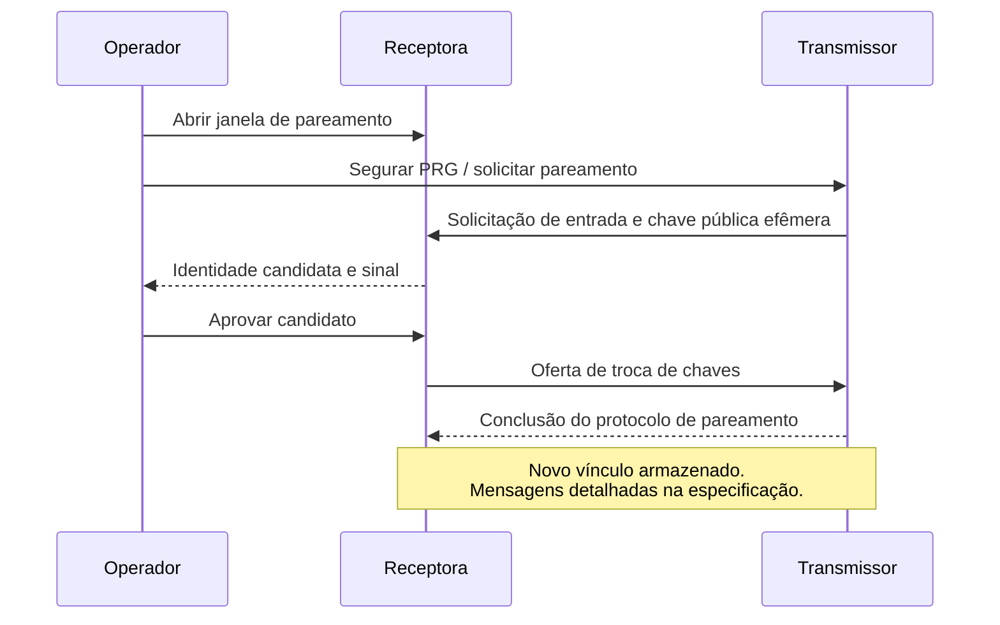

# Rádio e segurança

[English](../en/radio-security.md) | Português brasileiro

[Documentação](../../README.pt-BR.md)

## Topologia e transmissão

O protocolo LoRa direto conecta transmissores vinculados a uma receptora usando um
perfil de rádio compartilhado. Detecção de atividade no canal, atrasos aleatórios e
limites de tentativas reduzem a disputa pelo canal. O protocolo atual não implementa
LoRaWAN, roteamento em malha nem agendamento TDMA.

Tempo de ocupação do rádio, intervalos de envio, desempenho da antena e interferência
determinam a capacidade prática. IDs de rede distinguem redes lógicas; rádios no mesmo
canal continuam compartilhando o tempo de transmissão. Configure frequência e potência
para a região e a antena da instalação usando as [configurações da aplicação de rádio](https://github.com/cajui/cajui-firmware/blob/a2ce332b2e3ff704f8e35032381786497c287968/docs/radio-applications.md).

## Identidade e vínculo dos dispositivos

IDs de rede e de nó são identificadores públicos. O cadastro na rede cria um vínculo
entre transmissor e receptora com uma chave criptográfica exclusiva. Os nomes exibidos
no Central são independentes desse vínculo.

O provisionamento por USB e o pareamento por rádio criam vínculos compatíveis. O
pareamento por rádio exige que um operador abra uma janela de dois minutos na receptora,
solicite a entrada no transmissor e aprove a identidade candidata.

O diagrama resume o fluxo do operador. Os formatos de mensagens, a derivação de chaves
e as transições de estado estão definidos no [protocolo de pareamento](https://github.com/cajui/cajui-firmware/blob/a2ce332b2e3ff704f8e35032381786497c287968/docs/radio-pairing.md).

## Mecanismos de proteção

| Mecanismo | Finalidade | Limitação |
| --- | --- | --- |
| AES-128-GCM | Criptografa e autentica o conteúdo de DATA/ACK | Os cabeçalhos permanecem visíveis; interferência intencional é possível |
| Chaves exclusivas por vínculo | Separa credenciais entre nós cadastrados | O provisionamento e o armazenamento das chaves precisam ser confiáveis |
| Contadores duráveis e registros de aceitação | Preserva a unicidade dos nonces e rejeita replays | Estado antigo de contadores não pode ser restaurado sob uma chave ativa |
| Pareamento X25519/HKDF | Estabelece uma chave compartilhada resistente à interceptação passiva | Autenticação contra atacante ativo não está implementada |
| Janela de pareamento aberta pelo operador | Limita quando pedidos de entrada são aceitos | Acesso físico não autentica criptograficamente os pares de rádio |
| Sessão de configuração e validação de requisições | Restringe as requisições web aceitas | O ponto de acesso temporário de configuração fica aberto enquanto habilitado |
| Contas MQTT e ACLs | Restringe o acesso aos tópicos | O transporte MQTT atual da receptora usa TCP sem TLS |

## Limites de confiança

O ponto de acesso de configuração permite que clientes próximos entrem enquanto está
habilitado. A configuração e o pareamento devem ser realizados em ambiente controlado.
A conexão MQTT da receptora exige uma rede local confiável enquanto o suporte a TLS
não estiver disponível.

O protocolo não passou por auditoria independente de segurança. Preserve os registros
de vínculo e de contadores durante atualizações. A revogação invalida um vínculo de
rádio; remover um cadastro no Central ou desabilitar uma conta MQTT afeta outras camadas.

## Referências

[Protocolo](https://github.com/cajui/cajui-firmware/blob/a2ce332b2e3ff704f8e35032381786497c287968/docs/protocol-v1.md) · [Estado persistente](https://github.com/cajui/cajui-firmware/blob/a2ce332b2e3ff704f8e35032381786497c287968/docs/persistence.md) ·
[Provisionamento USB](https://github.com/cajui/cajui-firmware/blob/a2ce332b2e3ff704f8e35032381786497c287968/docs/provisioning.md) · [Política de segurança](https://github.com/cajui/cajui-firmware/blob/a2ce332b2e3ff704f8e35032381786497c287968/SECURITY.md)
