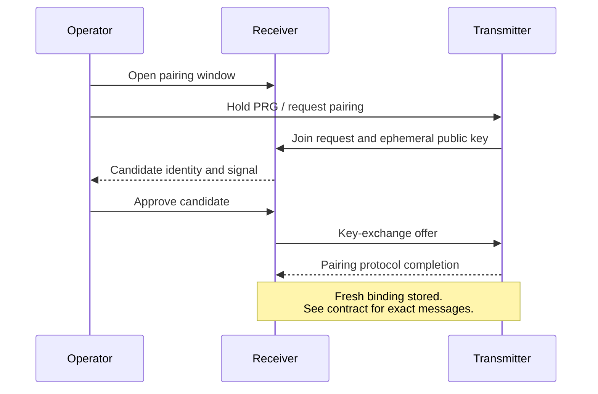

# Radio and security

[Documentation](../README.md)

## Topology and scheduling

The direct LoRa protocol connects enrolled transmitters to a receiver using a shared
radio profile. Channel activity detection, jitter and bounded retries reduce contention.
The current protocol does not implement LoRaWAN, mesh routing or TDMA scheduling.

Airtime, reporting intervals, antenna performance and interference determine practical
capacity. Network IDs distinguish logical networks; radios on the same channel still
share airtime. Configure frequency and transmit power for the deployment's region and
antenna using the [radio application settings](https://github.com/cajui/cajui-firmware/blob/a2ce332b2e3ff704f8e35032381786497c287968/docs/radio-applications.md).

## Device identity and enrollment

Network and node IDs are public identifiers. Enrollment creates a binding between a
transmitter and receiver with a unique cryptographic key. Display names in Central are
independent of this binding.

USB provisioning and radio pairing create compatible bindings. Radio pairing requires
an operator to open a two-minute receiver window, request joining on the transmitter
and approve the candidate identity.

This diagram summarizes the operator flow. Message formats, key derivation and state
transitions are specified in the [pairing protocol](https://github.com/cajui/cajui-firmware/blob/a2ce332b2e3ff704f8e35032381786497c287968/docs/radio-pairing.md).

## Protection mechanisms

| Mechanism | Purpose | Limitation |
| --- | --- | --- |
| AES-128-GCM | Encrypts and authenticates DATA/ACK payloads | Headers remain visible; jamming is possible |
| Unique binding keys | Separates credentials between enrolled nodes | Provisioning and key storage must be trusted |
| Durable counters and replay receipts | Preserves nonce uniqueness and rejects replays | Old counter state must not be restored under an active key |
| X25519/HKDF pairing | Establishes a shared key resistant to passive interception | Active-attacker authentication is not implemented |
| Operator-opened pairing window | Limits when enrollment requests are accepted | Physical access does not authenticate radio peers cryptographically |
| Setup session and request validation | Restricts accepted web requests | The temporary setup access point is open while enabled |
| MQTT accounts and ACLs | Restricts topic access | Current receiver MQTT transport uses plain TCP |

## Trust boundaries

The setup access point permits nearby clients to join while it is enabled. Operators
should perform configuration and pairing in a controlled environment. The receiver's
MQTT connection requires a trusted local network until TLS support is available.

The protocol has not undergone an independent security audit. Preserve enrollment and
counter records during updates. Revocation invalidates a radio binding; removing a
Central registration or disabling an MQTT account affects different layers.

## References

[Protocol](https://github.com/cajui/cajui-firmware/blob/a2ce332b2e3ff704f8e35032381786497c287968/docs/protocol-v1.md) · [Persistent state](https://github.com/cajui/cajui-firmware/blob/a2ce332b2e3ff704f8e35032381786497c287968/docs/persistence.md) ·
[USB provisioning](https://github.com/cajui/cajui-firmware/blob/a2ce332b2e3ff704f8e35032381786497c287968/docs/provisioning.md) · [Security policy](https://github.com/cajui/cajui-firmware/blob/a2ce332b2e3ff704f8e35032381786497c287968/SECURITY.md)
