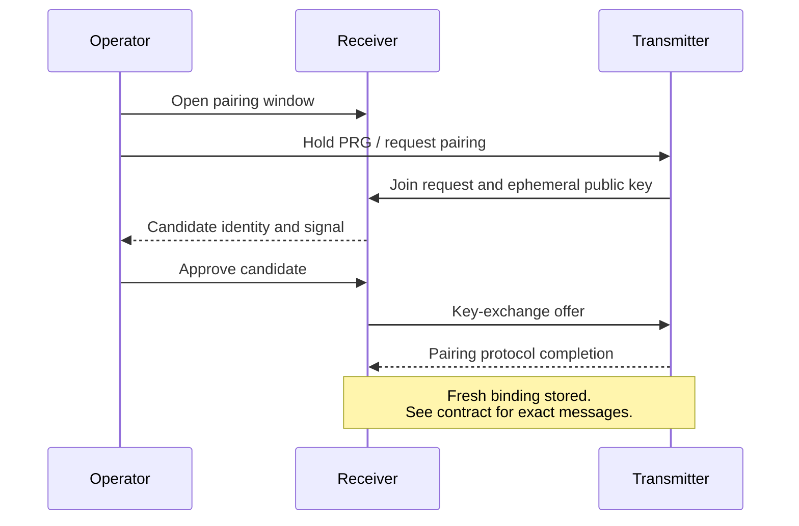

# Radio, pairing and security

[Documentation home](../README.md) · [Delivery boundaries](data-flow.md)

## Radio topology and scheduling

The current protocol is a direct LoRa star: multiple enrolled transmitters communicate
with a receiver using a shared radio profile. It is not LoRaWAN, a mesh or a TDMA
schedule. Channel activity detection, jitter and bounded retries reduce contention;
they cannot eliminate collisions or guarantee a node count at a particular range.

The radio profile, antenna, region, reporting intervals and interference determine
practical capacity. Network identifiers separate logical networks but cannot stop
another radio occupying the same channel. Do not mistake encryption for interference
protection. Use the [profile and power instructions](https://github.com/cajui/cajui-firmware/blob/a2ce332b2e3ff704f8e35032381786497c287968/docs/radio-applications.md)
for a specific build; this overview is not a frequency/regulatory guide.

## Identity, enrollment and display names

Stable network/node IDs are public identifiers. A binding associates a transmitter
with a receiver and a unique key. Renaming a device in Central changes a display name,
not that binding. Revoking a transmitter changes radio authorization; removing its
card only changes the application's inventory presentation.

USB provisioning and operator-triggered radio pairing create the same kind of binding.
The radio flow is:

The sketch intentionally omits wire-level messages. Use the
[radio pairing specification](https://github.com/cajui/cajui-firmware/blob/a2ce332b2e3ff704f8e35032381786497c287968/docs/radio-pairing.md) for the complete exchange.

## Security boundaries

| Mechanism | Protects against / enables | Remaining boundary |
| --- | --- | --- |
| AES-128-GCM DATA/ACK | Confidentiality and authenticated telemetry | Does not hide every header or prevent jamming |
| Per-binding keys | Isolation between enrolled nodes | Key handling/provisioning must remain trustworthy |
| Durable counters and replay receipts | Nonce uniqueness and duplicate/replay decisions | Restoring old state under a current key is unsafe |
| X25519/HKDF radio pairing | Key agreement protected from passive interception | Active-attacker authentication during pairing remains unresolved |
| Short, operator-opened pairing window | Limits when joining is possible | Physical action is not cryptographic identity verification |
| Local setup form/session checks | Constrains web requests | Setup Wi-Fi AP is still open to nearby users while enabled |
| MQTT credentials and ACLs | Restricts publishing/subscribing | Current receiver transport is plain TCP, not TLS |

The protocol has not undergone an independent security audit. Preserve enrollment,
counters and queue storage during normal updates. Never clone secrets or restore old
counter records as a way to reuse an enrolled image.

Sources: [protocol](https://github.com/cajui/cajui-firmware/blob/a2ce332b2e3ff704f8e35032381786497c287968/docs/protocol-v1.md), [persistent state](https://github.com/cajui/cajui-firmware/blob/a2ce332b2e3ff704f8e35032381786497c287968/docs/persistence.md),
[pairing](https://github.com/cajui/cajui-firmware/blob/a2ce332b2e3ff704f8e35032381786497c287968/docs/radio-pairing.md), [security policy](https://github.com/cajui/cajui-firmware/blob/a2ce332b2e3ff704f8e35032381786497c287968/SECURITY.md).
